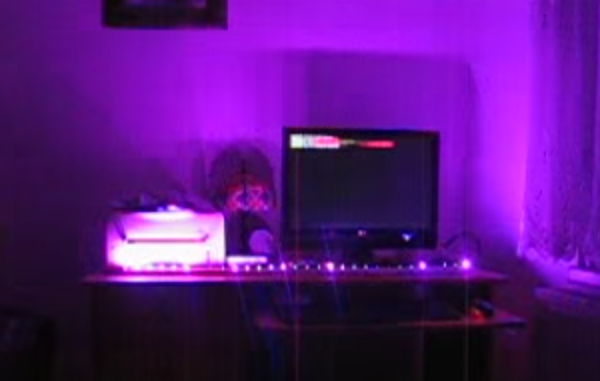

# LED szalag orgona

[Angol fordítás - English translation](README.md)

## Tartalomjegyzék
  * [Bevezetés](#bevezetés)
  * [LED-ek irányítása](#led-ek-irányítása)
    * [Háttérszín LED-ek](#háttérszín-led-ek)
    * [Effekt LED-ek](#effekt-led-ek)
  * [Kapcsolási rajz](#kapcsolási-rajz)
    * [Áramkör](#Áramkör)
    * [Nyák-terv](#nyák-terv)
    * [Fényképek az elkészült panelről](#fényképek-az-elkészült-panelről)
  * [Használat](#használat)
    * [Fordítás és telepítés](#Fordítás-és-telepítés)
    * [Földhurok leválasztó kapcsoló](#földhurok-leválasztó-kapcsoló)
    * [Megfelelő hangerő kiválasztása](#megfelelő-hangerő-kiválasztása)
  * [Jelfeldolgozás](#jelfeldolgozás)
    * [Mintavételezés és keretek (frame-k)](#mintavételezés-és-keretek-frame-k)
    * [Mono átalakítás](#mono-átalakítás)
    * [Jelenergia számítás](#jelenergia-számítás)
    * [Spektrum analízis (FFT)](#spektrum-analízis-FFT)
    * [Aluláteresztő (basszus) szűrés](#aluláteresztő-basszus-szűrés)
    * [Basszus energia számítás](#basszus-energia-számítás)
    * [Beat érzékelés](#beat-érzékelés)
  * [Nyomkövetés](#nyomkövetés)

## Bevezetés

Kölyök koromban fantasztikusat buliztunk stroboszkóppal, amit az egyik haver készített, a mai napig emlékszem rá.
Egyszerű kapcsolás volt, ha egy frekvenciatartományban a frekvencia meghaladott egy bizonyos értéket, akkor a lámpa bekapcsolt, egyébként meg kikapcsolt. Potméterrel lehetett mindhárom lámpára beállítani, hogy hol kapcsoljon be és ki.
Ez a világ a 90-es évek volt, ma már sokkal ütősebb eszközök készíthetőek el jóval kevesebb pénzből. Gyakorlatilag bármit leprogramozhatunk és nem csak 3 lámpával, hanem tetszőleges számú LED-del.

Youtube videó:

## LED-ek irányítása

TODO

### Háttérszín LED-ek

TODO

### Effekt LED-ek

TODO

## Kapcsolási rajz

TODO

### Áramkör

TODO

### Nyák-terv

TODO

### Fényképek az elkészült panelről

TODO

## Használat

TODO

### Fordítás és telepítés

TODO

### Földhurok leválasztó kapcsoló

TODO

### Megfelelő hangerő kiválasztása

TODO

## Jelfeldolgozás

TODO

### Mintavételezés és keretek (frame-k)

TODO

### Mono átalakítás

TODO

### Jelenergia számítás

TODO

### Spektrum analízis (FFT)

TODO

### Aluláteresztő (basszus) szűrés

TODO

### Basszus energia számítás

TODO

### Beat érzékelés

TODO

## Nyomkövetés

TODO
