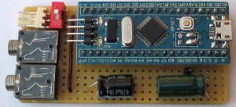
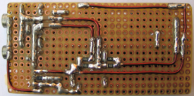

# LED szalag orgona

[Angol fordítás - English translation](README.md)

## Tartalomjegyzék
  * [Bevezetés](#bevezetés)
  * [LED-ek vezérlése](#led-ek-vezérlése)
    * [Háttérszín LED-ek](#háttérszín-led-ek)
    * [Effekt LED-ek](#effekt-led-ek)
  * [Az áramkör](#az-áramkör)
    * [Kapcsolási rajz](#kapcsolási-rajz)
    * [Nyák-terv](#nyák-terv)
    * [Fényképek az elkészült panelről](#fényképek-az-elkészült-panelről)
  * [Használat](#használat)
    * [Fordítás és telepítés](#fordítás-és-telepítés)
    * [Földhurok leválasztó kapcsoló](#földhurok-leválasztó-kapcsoló)
    * [Megfelelő hangerő kiválasztása](#megfelelő-hangerő-kiválasztása)
  * [Jelfeldolgozás](#jelfeldolgozás)
    * [Mintavételezés és keretek (frame-k)](#mintavételezés-és-keretek-frame-k)
    * [Mono átalakítás](#mono-átalakítás)
    * [Jelenergia számítás](#jelenergia-számítás)
    * [Spektrum analízis (FFT)](#spektrum-analízis-fft)
    * [Aluláteresztő (basszus) szűrés](#aluláteresztő-basszus-szűrés)
    * [Basszus energia számítás](#basszus-energia-számítás)
    * [Beat érzékelés](#beat-érzékelés)
  * [Nyomkövetés](#nyomkövetés)

## Bevezetés

Kölyök koromban fantasztikusat buliztunk stroboszkóppal, amit az egyik haver készített, a mai napig emlékszem rá.
Egyszerű kapcsolás volt, ha egy frekvenciatartományban a frekvencia meghaladott egy bizonyos értéket, akkor a lámpa bekapcsolt, egyébként meg kikapcsolt. Potméterrel lehetett mindhárom lámpára beállítani, hogy hol kapcsoljon be és ki.
Ez a világ a 90-es évek volt, ma már sokkal ütősebb eszközök készíthetőek el jóval kevesebb pénzből. Gyakorlatilag bármit leprogramozhatunk és nem csak 3 lámpával, hanem tetszőleges számú LED-del.

Youtube videó:

## LED-ek vezérlése

A LED-ek színsémája ezen a képen látható:

### Háttérszín LED-ek

A háttérszín LED-ek folyamatosan világítanak, színt váltanak amikor a mikrovezérlő ütemet érzékel (beat detection). A feladatuk a háttér alapszín biztosítása

### Effekt LED-ek

| Szám   | Név&nbsp;&nbsp;&nbsp;&nbsp;&nbsp;&nbsp;&nbsp;&nbsp;&nbsp;&nbsp;&nbsp;&nbsp;&nbsp;&nbsp;&nbsp;&nbsp;&nbsp;&nbsp;&nbsp;&nbsp;&nbsp;&nbsp;&nbsp;&nbsp;&nbsp;&nbsp;&nbsp;&nbsp;&nbsp;&nbsp;&nbsp;&nbsp;&nbsp;&nbsp;&nbsp;&nbsp;&nbsp;&nbsp;&nbsp;&nbsp;&nbsp;&nbsp;&nbsp;&nbsp;&nbsp;| Feladat                                                                                                                             |
|:------:|:---------------------------------------------------|:------------------------------------------------------------------------------------------------------------------------------------|
| 1. / A | Energia-mérő&nbsp;LED (fehér)                      | Négyzetes energia közép alapján állítja a LED-ek intenzitását a fehér egy árnyalatára.                                              |
| 1. / B | Energia-mérő&nbsp;LED (világos&nbsp;háttér)        | Négyzetes energia közép alapján állítja a LED-ek intenzitását a háttérszín LED színének egy világosabb árnyalatára.                 |
| 2. / A | Energiacsúcs-mérő&nbsp;LED (fehér)                 | A négyzetes energia közép függvény csúcsát érzékelve a LED-et fehéren felvillantja.                                                 |
| 2. / B | Energiacsúcs-mérő&nbsp;LED (világos&nbsp;háttér)   | A négyzetes energia közép függvény csúcsát érzékelve a LED-et világosított háttérszínen felvillantja.                               |
| 3.     | Basszuscsúcs-mérő&nbsp;LED                         | A LED-et kéken felvillantja, amikor a basszus frekvenciákon energiacsúcsot érzékel.                                                 |
| 4.     | Spektrumcsúcs-mérő&nbsp;LED                        | Az FFT-vel számolt frekvenciatartomány 6 részre van felosztva. Egy LED egy intervallum csúcsának érzékelésekor villan fel.          |
| 5. / A | RGB&nbsp;villogó&nbsp;(1,4,6)                      | A LED színe a frekvenciaintervallumok alapján számolódik, az (1,4,6) intervallumok a vörös, zöld, kék komponenseket határozzák meg. |
| 5. / B | RGB&nbsp;villogó&nbsp;(5,3,2)                      | A LED színe a frekvenciaintervallumok alapján számolódik, az (5,3,2) intervallumok a vörös, zöld, kék komponenseket határozzák meg. |

## Az áramkör

### Kapcsolási rajz

### Nyák-terv

### Fényképek az elkészült panelről

Így néz ki kívülről:

 

Ha felnyitjuk a fedelét:

A panel:

 

## Használat

### Fordítás és telepítés

A projekt Eclipse fejlesztő-környezetet használ GNU ARM Eclipse pluginnal és openocd-vel. A kódot ST-LINK-kel lehet feltölteni a mikrovezérlőre.

A vezérlő típusa STM32F103 (blue pill panel):

### Földhurok leválasztó kapcsoló

Az audio földet és az STM32 földjét DIP kapcsoló köti össze. A kapcsolót be kell kapcsolni, amikor az audio és a mikrovezérlő külön földet használ (pl. a táp USB töltőről jön, a zene HiFi-ről).
Ha ugyanazt a földet használják (számítógép USB portról jön a táp és a zene is a számítógépről jön), akkor a kapcsolót ki kell kapcsolni, hogy a földhurok ne okozzon problémát.

### Megfelelő hangerő kiválasztása

A program nem tudja kitalálni, hogy egy szám éppen halk-e, vagy csak a hangerő van lehúzva. A szalag megfelelően beállított hangerő mellett lesz a legszebb, amikor az audio jel [-1.5V, 1.5V] között van.
Én 95%-ra állítottam a hangerőt, hogy a legnagyobb kimenő feszültségeket adja, de még ne kezdjen torzítani se. Ez a megkötés nem túl erős, mert olcsón USB-s hangkártyát is lehet kapni, ami lehetővé teszi a LED szalag és a hangszóró hangerejének külön történő beállítását.

## Jelfeldolgozás

### Mintavételezés és keretek (frame-k)

Az áramkör a zenét 44100 Hz-en mintavételezi sztereóban, az STM32 ADC1/ADC2 moduljaival.

A jelet 128 mintás keretekre (frame) osztjuk, ezek a keretek határozzák majd meg az egyes LED-ek színét.

### Mono átalakítás

A könnyebb kezelhetőség végett a jelet monóba alakítjuk a következő képlet alapján:

### Jelenergia számítás

A jelenergia számításához szükséges a mintaátlag:

  * s[i] az egyes mintákat jelöli
  * i0 a keret első elemének indexe

 

A jelenergiát a következő képlet adja:

Az 'Energia-mérő LED' és az 'Energiacsúcs-mérő LED' intenzitását számoljuk ezzel az értékkel.

### Spektrum analízis (FFT)

TODO

### Aluláteresztő (basszus) szűrés

TODO

### Basszus energia számítás

TODO

### Beat érzékelés

TODO

## Nyomkövetés

TODO
