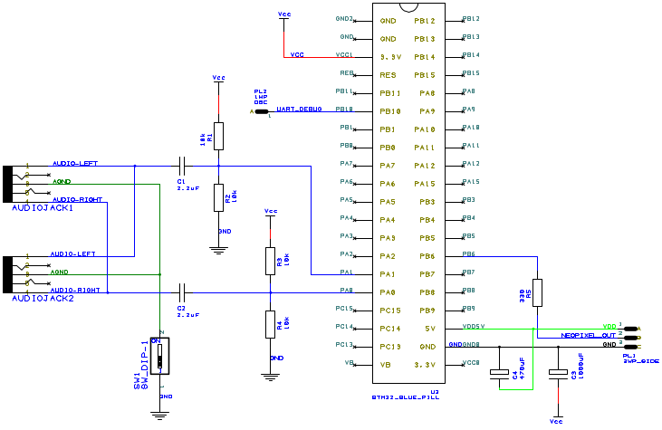
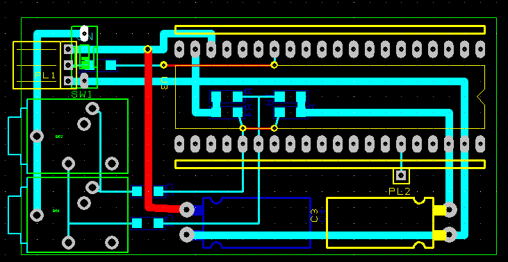
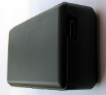
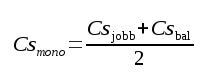
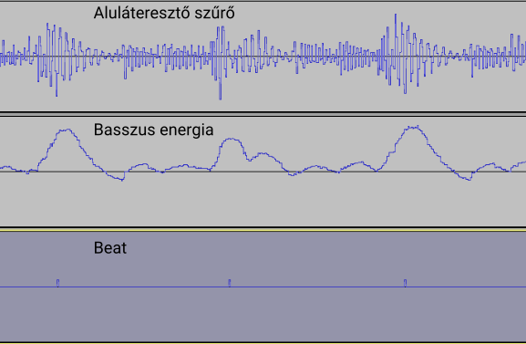
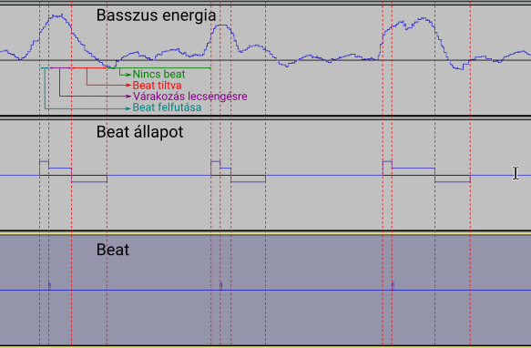
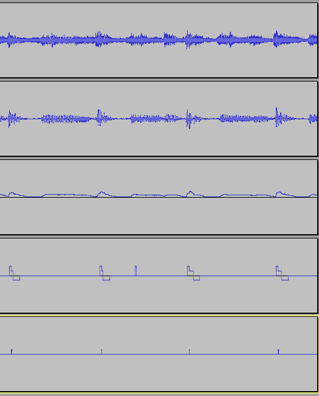

# LED szalag orgona

[Angol fordítás - English translation](README.md)

## Tartalomjegyzék
  * [Bevezetés](#bevezetés)
  * [LED-ek vezérlése](#led-ek-vezérlése)
    * [Háttérszín LED-ek](#háttérszín-led-ek)
    * [Effekt LED-ek](#effekt-led-ek)
  * [Az áramkör](#az-áramkör)
    * [Kapcsolási rajz](#kapcsolási-rajz)
    * [Nyák-terv](#nyák-terv)
    * [Fényképek az elkészült panelről](#fényképek-az-elkészült-panelről)
  * [Használat](#használat)
    * [Fordítás és telepítés](#fordítás-és-telepítés)
    * [Földhurok leválasztó kapcsoló](#földhurok-leválasztó-kapcsoló)
    * [Megfelelő hangerő kiválasztása](#megfelelő-hangerő-kiválasztása)
  * [Jelfeldolgozás](#jelfeldolgozás)
    * [Mintavételezés és keretek (frame-k)](#mintavételezés-és-keretek-frame-k)
    * [Mono átalakítás](#mono-átalakítás)
    * [Jelenergia számítás](#jelenergia-számítás)
    * [Spektrum analízis (FFT)](#spektrum-analízis-fft)
    * [Aluláteresztő (basszus) szűrés](#aluláteresztő-basszus-szűrés)
    * [Basszus energia számítás](#basszus-energia-számítás)
    * [Beat érzékelés](#beat-érzékelés)
  * [Nyomkövetés](#nyomkövetés)

## Bevezetés

Kölyök koromban fantasztikusat buliztunk stroboszkóppal, amit az egyik haver készített, a mai napig emlékszem rá.
Egyszerű kapcsolás volt, ha egy frekvenciatartományban a frekvencia meghaladott egy bizonyos értéket, akkor a lámpa bekapcsolt, egyébként meg kikapcsolt. Potméterrel lehetett mindhárom lámpára beállítani, hogy hol kapcsoljon be és ki.
Ez a világ a 90-es évek volt, ma már sokkal ütősebb eszközök készíthetőek el jóval kevesebb pénzből. Gyakorlatilag bármit leprogramozhatunk és nem csak 3 lámpával, hanem tetszőleges számú LED-del.

Youtube videó:

[](https://www.youtube.com/watch?v=_tZMUPP6Tb4 "LED strip organ")

## LED-ek vezérlése

A LED-ek színsémája ezen a képen látható:


### Háttérszín LED-ek

A háttérszín LED-ek folyamatosan világítanak, színt váltanak amikor a mikrovezérlő ütemet érzékel (beat detection). A feladatuk a háttér alapszín biztosítása

### Effekt LED-ek

| Szám   | Név&nbsp;&nbsp;&nbsp;&nbsp;&nbsp;&nbsp;&nbsp;&nbsp;&nbsp;&nbsp;&nbsp;&nbsp;&nbsp;&nbsp;&nbsp;&nbsp;&nbsp;&nbsp;&nbsp;&nbsp;&nbsp;&nbsp;&nbsp;&nbsp;&nbsp;&nbsp;&nbsp;&nbsp;&nbsp;&nbsp;&nbsp;&nbsp;&nbsp;&nbsp;&nbsp;&nbsp;&nbsp;&nbsp;&nbsp;&nbsp;&nbsp;&nbsp;&nbsp;&nbsp;&nbsp;| Feladat                                                                                                                             |
|:------:|:---------------------------------------------------|:------------------------------------------------------------------------------------------------------------------------------------|
| 1. / A | Energia-mérő&nbsp;LED (fehér)                      | Négyzetes energia közép alapján állítja a LED-ek intenzitását a fehér egy árnyalatára.                                              |
| 1. / B | Energia-mérő&nbsp;LED (világos&nbsp;háttér)        | Négyzetes energia közép alapján állítja a LED-ek intenzitását a háttérszín LED színének egy világosabb árnyalatára.                 |
| 2. / A | Energiacsúcs-mérő&nbsp;LED (fehér)                 | A négyzetes energia közép függvény csúcsát érzékelve a LED-et fehéren felvillantja.                                                 |
| 2. / B | Energiacsúcs-mérő&nbsp;LED (világos&nbsp;háttér)   | A négyzetes energia közép függvény csúcsát érzékelve a LED-et világosított háttérszínen felvillantja.                               |
| 3.     | Basszuscsúcs-mérő&nbsp;LED                         | A LED-et kéken felvillantja, amikor a basszus frekvenciákon energiacsúcsot érzékel.                                                 |
| 4.     | Spektrumcsúcs-mérő&nbsp;LED                        | Az FFT-vel számolt frekvenciatartomány 6 részre van felosztva. Egy LED egy intervallum csúcsának érzékelésekor villan fel.          |
| 5. / A | RGB&nbsp;villogó&nbsp;(1,4,6)                      | A LED színe a frekvenciaintervallumok alapján számolódik, az (1,4,6) intervallumok a vörös, zöld, kék komponenseket határozzák meg. |
| 5. / B | RGB&nbsp;villogó&nbsp;(5,3,2)                      | A LED színe a frekvenciaintervallumok alapján számolódik, az (5,3,2) intervallumok a vörös, zöld, kék komponenseket határozzák meg. |

## Az áramkör

### Kapcsolási rajz



### Nyák-terv



### Fényképek az elkészült panelről

Így néz ki kívülről:

[](docs/images/photo_enclosure2.png) [](docs/images/photo_enclosure1.png)

Ha felnyitjuk a fedelét:

[](docs/images/photo_inside.png)

A panel:

[](docs/images/photo_pcb_top.png) [](docs/images/photo_pcb_bottom.png)

## Használat

### Fordítás és telepítés

A projekt Eclipse fejlesztő-környezetet használ GNU ARM Eclipse pluginnal és openocd-vel. A kódot ST-LINK-kel lehet feltölteni a mikrovezérlőre.

A vezérlő típusa STM32F103 (blue pill panel):


### Földhurok leválasztó kapcsoló

Az audio földet és az STM32 földjét DIP kapcsoló köti össze. A kapcsolót be kell kapcsolni, amikor az audio és a mikrovezérlő külön földet használ (pl. a táp USB töltőről jön, a zene HiFi-ről).
Ha ugyanazt a földet használják (számítógép USB portról jön a táp és a zene is a számítógépről jön), akkor a kapcsolót ki kell kapcsolni, hogy a földhurok ne okozzon problémát.

### Megfelelő hangerő kiválasztása

A program nem tudja kitalálni, hogy egy szám éppen halk-e, vagy csak a hangerő van lehúzva. A szalag megfelelően beállított hangerő mellett lesz a legszebb, amikor az audio jel [-1.5V, 1.5V] között van.
Én 95%-ra állítottam a hangerőt, hogy a legnagyobb kimenő feszültségeket adja, de még ne kezdjen torzítani se. Ez a megkötés nem túl erős, mert olcsón USB-s hangkártyát is lehet kapni, ami lehetővé teszi a LED szalag és a hangszóró hangerejének külön történő beállítását.

## Jelfeldolgozás

### Mintavételezés és keretek (frame-k)

Az áramkör a zenét 44100 Hz-en mintavételezi sztereóban, az STM32 ADC1/ADC2 moduljaival.

A jelet 128 mintás keretekre (frame) osztjuk, ezek a keretek határozzák majd meg az egyes LED-ek színét.

### Mono átalakítás

A könnyebb kezelhetőség végett a jelet monóba alakítjuk a következő képlet alapján:



### Jelenergia számítás

A jelenergia számításához szükséges a mintaátlag:


  * s[i] az egyes mintákat jelöli
  * i0 a keret első elemének indexe

<br/>

A jelenergiát a következő képlet adja:


Az 'Energia-mérő LED' és az 'Energiacsúcs-mérő LED' intenzitását számoljuk ezzel az értékkel.

### Spektrum analízis (FFT)

A program a 128 mintás kereteket frekvenciatartományba alakítja FFT-vel. Minthogy a mintavételi frekvencia 44100 Hz, a felbontás
44100 / 128 = 344 Hz lesz (a teljes tartományt 64 zsákra osztjuk 344 Hz-enként).

Zsákok csoportosítása:

| Csoport |  Zsák  |      Frekvencia     |
|:-------:|:------:|:-------------------:|
|    1    |    1   |   344 Hz - 689 Hz   |
|    2    |   2-3  |   689 Hz - 1378 Hz  |
|    3    |   4-7  |  1378 Hz - 2756 Hz  | 
|    4    |  8-15  |  2756 Hz - 5513 Hz  | 
|    5    | 16-31  |  5513 Hz - 11025 Hz | 
|    6    | 32-63  | 11025 Hz - 22050 Hz | 

A 'Spektrumcsúcs-mérő LED' és az 'RGB villogó' színét számoljuk frekvencia csoportok alapján.


### Aluláteresztő (basszus) szűrés

A basszus görbét (aluláteresztő görbe) a legutolsó 170 minta átlaga alapján számoljuk (mozgóátlag).
Mivel egy keret csak 128 mintát tartalmaz, ezért az előző keret utolsó 42 mintáját is felhasználjuk a számoláshoz.


Az így kapott szűrő vágási frekvenciája 120 Hz körül van, ami elég jó ahhoz, hogy a mély hangokat leválasszuk a zenéről.

A szűrő válasza különféle frekvenciákra:


### Basszus energia számítás

A basszus energiát a jelenergiához hasonlóan számoljuk az utolsó 20 keret mozgóátlagaiból:


A beat érzékelést és a 'Basszuscsúcs-mérő LED' intenzitását számoljuk ebből az értékből.


### Beat érzékelés

A beat-ek gyors energia-ugrások a basszus frekvenciákon:



**Követelmények egy beatre**:
* A beatnek nagyobbnak kell lennie, mint a basszus energia átlag és egy hozzáadott küszöbérték (300)
* Adott időintervallumon a legkisebb és legnagyobb basszus energia közti aránynak el kell érni egy megadott értéket (1.75X)
* Egy beat gyorsan történik, a fokozatos energiaemelkedést nem tekinthetjük beatnek
* Egy basszus energia-csúcshoz egy beat tartozhat
* Két beat között egy adott időnek el kell telnie, nem követhetik egymás tetszőleges gyorsan

**Beat állapotok**:
* Nincs beat
* Beat felfutása
* Várakozás lecsengésre
* Beat tiltva

Kép:




## Nyomkövetés

A LED szalag orgona USB-UART átalakítóval nyomkövethető. Nem minden átalakító használható erre a célra, mert az adatok átviteli sebessége magas, 2000000 baud (2 mbaud). A PL2303, CH340G, FTDI chipek képesek ilyen sebesség melletti adatátvitelre, a CP2102 nem. Gyors USB-UART konverter és csöndes USB busz szükséges a nyomkövetéshez (nem érdemes USB SD kártyára fájlokat másolni nyomkövetés közben, mert ez lecsökkenti a busz sávszélességét).


Az elküldött UART csomag formája:

| Byte  | Feladat         | Részletes leírás                                         |
|:-----:|:----------------|:---------------------------------------------------------|
| 0-4   | azonosító       | 0xC50EDAB1 byte-ok az UART csomag kezdetét jelölik       |
| 5-6   | átlag           | a kerethez tartozó átlagérték (128 mintából véve)        |
| 7     | keret szám      | a keretszám alsó 8 bitje                                 |
| 8     | jelzőbitek      | bit 7: beat érzékelés, bit 0-2: beat állapot             |
| 9-10  | basszus energia | a kiszámolt basszus energia                              |
| 10-11 | basszus görbe   | az aluláteresztő szűrő kimenete                          |
| 12-13 | beat nagyság    | beat érzékeléshez használt beat nagyság értéke           |
| 14-77 | minták          | 32 x 16 bites minták (a zene 11025Hz monóba alakítva)    |


<br/>
UART hallgatás Linux-on:

```
cd test
./serialread.sh
```

Ez az adatokat a 'data.bin' fájlba fogja menteni.

```
./decode_frames.pl
```

A fenti parancs 5 wave fájlt fog előállítani a kapott adatokból:

| Fájl                     | Jelentése                                                                                                           |
|:-------------------------|:--------------------------------------------------------------------------------------------------------------------|
| output_1_music.wav       | A zene 11025 Hz monóba alakítva. Hasznos, mert bele lehet hallgatni, hogy mit hallott az eszköz mintavételezésnél   |
| output_2_bass_curve.wav  | Az aluláteresztő szűrő kimenete. Bele lehet hallgatni, hogy mi jön át szűrés után                                   |
| output_3_bass_energy.wav | A basszus energia                                                                                                   |
| output_4_beat_state.wav  | Beat állapot információ                                                                                             |
| output_5_beat.wav        | Jelző, hogy beat-et érzékelt-e az eszköz                                                                            |

**A dekódolt sávok Audacity-n:**


