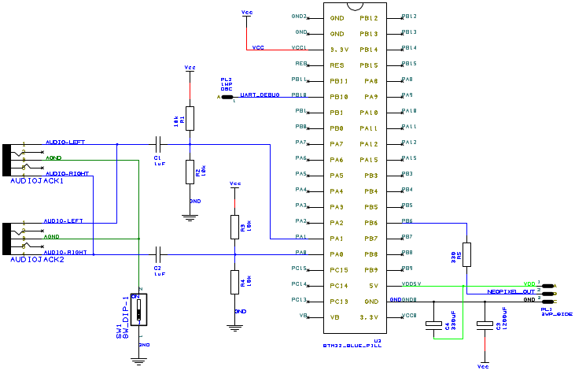
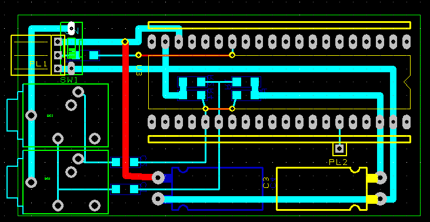
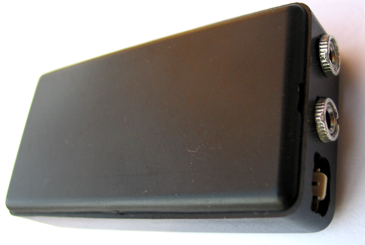
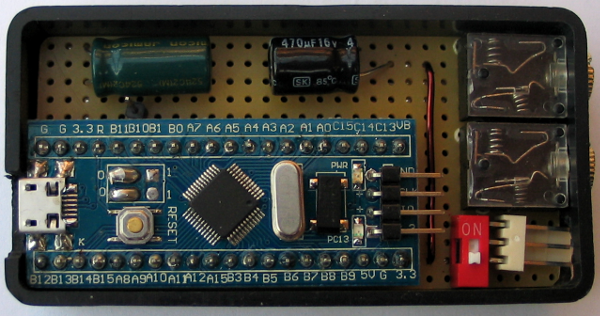
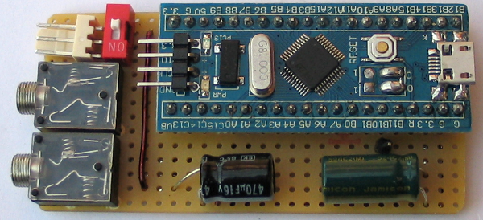
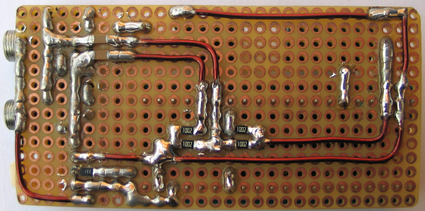

# LED Strip Organ

[Hungarian translation - magyar fordítás](OLVASSEL.md)

## Table of Contents
  * [Introduction](#introduction)
  * [Controlling the LEDs (bulbs)](#controlling-the-leds-bulbs-)
    * [Background bulb](#background-bulb)
    * [Effect bulbs](#effect-bulbs)
  * [Circuit Diagram](#circuit-diagram)
    * [Schema](#schema)
    * [PCB design](#pcb-design)
    * [Photos](#photos)
  * [Usage](#usage)
    * [Compiling and installing](#compiling-and-installing)
    * [Ground-loop switch](#ground-loop-switch)
    * [Choosing the right volume](#choosing-the-right-volume)
  * [Signal processing](#signal-processing)
    * [Sampling and frames](#sampling-and-frames)
    * [Energy calculation](#energy-calculation)
    * [Spectral analysis (FFT)](#spectral-analysis-FFT-)
    * [Digital low pass filtering (bass)](#digital-low-pass-filtering-bass-)
    * [Beat detection](#beat-detection)
  * [Debugging](#debugging)

## Introduction

The project is a LED Strip Light Organ implementation using STM32 (blue pill).

When I was a kid we organized fantastic dance parties using a stroboscope created one of my friend. This was a simple circuit switching 3 lamps, that were turned on/off when a frequency was over/under a threshold value. There were 3 potentiometers for the 3 lamps for configuring this threshold.
This was the 90's, but nowadays much better equipments can be made from fewer money. One can program anything he wants and use not only 3 lamps, but arbitrary number of LEDs.

Youtube video:

## Controlling the LEDs (bulbs)
The color schema of the LED-s (bulbs):

### Background bulb
The background LEDs give permanent light and change color when STM32 detects beat. Those LEDs are for giving light even if music is not played.
 
### Effect bulbs

| Number | Name                                                    | Purpose                                                                                                                                                                                             |
|:------:|:--------------------------------------------------------|:----------------------------------------------------------------------------------------------------------------------------------------------------------------------------------------------------|
| 1. / A | Energy&nbsp;bulb&nbsp;(white)                           | Measures the RMS energy of the sound. The intensity of the LED is calculated from white color using the sound energy.                                                                               |
| 1. / B | Energy&nbsp;bulb&nbsp;(light&nbsp;background)           | Measures the RMS energy of the sound. The intensity of the LED is calculated from lightened background color using the sound energy.                                                                |
| 2. / A | Energy&nbsp;peak&nbsp;bulb&nbsp;(white)                 | Detects peaks in the RMS energy of the sound. The LED flashes in white when energy peak happens.                                                                                                    |
| 2. / B | Energy&nbsp;peak&nbsp;bulb&nbsp;(light&nbsp;background) | Detects peaks in the RMS energy of the sound. The LED flashes in light background color when energy peak happens.                                                                                   |
| 3.     | Bass&nbsp;peak&nbsp;bulb                                | Detects peaks in the bass energy of the sound. The LED flashes in blue when bass energy peak happens.                                                                                               |
| 4.     | Spectral&nbsp;peak&nbsp;bulb&nbsp;                      | The frequency domain (calculated by FFT) is splitted into 6 intervals. One LED represents one interval of the domain. The LED flashes when a peak is detected on the interval.                      |
| 5. / A | RGB&nbsp;blinker&nbsp;(1,4,6)                           | The color of the LED is calculated using three intervals of FFT ( [1,4,6] ). One interval is for red, one for green, one for blue. The result is a composite color.                                 |
| 5. / B | RGB&nbsp;blinker&nbsp;(5,3,2)                           | The color of the LED is calculated using three intervals of FFT ( [5,3,2] ). One interval is for red, one for green, one for blue. The result is a composite color.                                 |

## Circuit Diagram

### Schema

### PCB design

### Photos

The enclosure:

Inside:

The PCB:

## Usage

### Compiling and installing

The project uses the Eclipse environment, GNU ARM Eclipse plugin and openocd for development. The code can be uploaded with ST-LINK after compilation.

The STM32F103 MCU (blue pill board) is used for audio sampling:

### Ground-loop switch

The grounds of audio and STM32 is connected if the swich is on state. It's important if audio and LED strip power sources are isolated.
If the same equipment provides power for audio and for the strip, the switch has to be turned off to prevent ground loops.

### Choosing the right volume

The code can't figure out whether the music is quiet or the volume is turned down. This LED strip requires adjusting the volume level to reach the best quality. The strip produces the nicest result when the volume is between the [-1.5V,1.5V] range with no distortion. I use 95% volume level. This is not a big restriction as one can buy cheap USB sound cards and set different volume on the USB card and on the speakers.

## Signal processing

### Sampling and frames

TODO

### Energy calculation

TODO

### Spectral analysis (FFT)

TODO

### Digital low pass filtering (bass)

TODO

### Beat detection

TODO

## Debugging

TODO
