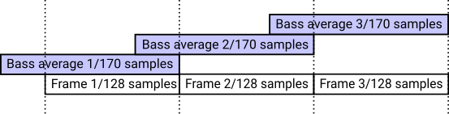

# LED Strip Organ

[Hungarian translation - magyar fordítás](OLVASSEL.md)

## Table of Contents
  * [Introduction](#introduction)
  * [Controlling the LEDs (bulbs)](#controlling-the-leds-bulbs)
    * [Background bulb](#background-bulb)
    * [Effect bulbs](#effect-bulbs)
  * [Circuit Diagram](#circuit-diagram)
    * [Schema](#schema)
    * [PCB design](#pcb-design)
    * [Photos of the home made board](#photos-of-the-home-made-board)
  * [Usage](#usage)
    * [Compiling and installing](#compiling-and-installing)
    * [Ground-loop switch](#ground-loop-switch)
    * [Choosing the right volume](#choosing-the-right-volume)
  * [Signal processing](#signal-processing)
    * [Sampling and frames](#sampling-and-frames)
    * [Mono conversion](#mono-conversion)
    * [Energy calculation](#energy-calculation)
    * [Spectral analysis (FFT)](#spectral-analysis-fft)
    * [Digital low pass filtering (bass)](#digital-low-pass-filtering-bass)
    * [Bass energy calculation](#bass-energy-calculation)
    * [Beat detection](#beat-detection)
  * [Debugging](#debugging)


## Introduction

The project is a LED Strip Light Organ implementation using STM32 (blue pill).

When I was a kid we organized fantastic dance parties using a stroboscope created one of my friend. This was a simple circuit switching 3 lamps, that were turned on/off when a frequency was over/under a threshold value. There were 3 potentiometers for the 3 lamps for configuring this threshold.
This was the 90's, but nowadays much better equipments can be made from fewer money. One can program anything he wants and use not only 3 lamps, but arbitrary number of LEDs.

Youtube video:

[](https://www.youtube.com/watch?v=2DC7uQUITys "LED strip organ")


## Controlling the LEDs (bulbs)
The color schema of the LED-s (bulbs):


### Background bulb
The background LEDs give permanent light and change color when STM32 detects beat. Those LEDs are for giving light even if music is not played.
 
### Effect bulbs

| Number | Name                                                    | Purpose                                                                                                                                                                                             |
|:------:|:--------------------------------------------------------|:----------------------------------------------------------------------------------------------------------------------------------------------------------------------------------------------------|
| 1. / A | Energy&nbsp;bulb&nbsp;(white)                           | Measures the RMS energy of the sound. The intensity of the LED is calculated from white color using the sound energy.                                                                               |
| 1. / B | Energy&nbsp;bulb&nbsp;(light&nbsp;background)           | Measures the RMS energy of the sound. The intensity of the LED is calculated from lightened background color using the sound energy.                                                                |
| 2. / A | Energy&nbsp;peak&nbsp;bulb&nbsp;(white)                 | Detects peaks in the RMS energy of the sound. The LED flashes in white when energy peak happens.                                                                                                    |
| 2. / B | Energy&nbsp;peak&nbsp;bulb&nbsp;(light&nbsp;background) | Detects peaks in the RMS energy of the sound. The LED flashes in light background color when energy peak happens.                                                                                   |
| 3.     | Bass&nbsp;peak&nbsp;bulb                                | Detects peaks in the bass energy of the sound. The LED flashes in blue when bass energy peak happens.                                                                                               |
| 4.     | Spectral&nbsp;peak&nbsp;bulb&nbsp;                      | The frequency domain (calculated by FFT) is splitted into 6 intervals. One LED represents one interval of the domain. The LED flashes when a peak is detected on the interval.                      |
| 5. / A | RGB&nbsp;blinker&nbsp;(1,4,6)                           | The color of the LED is calculated using three intervals of FFT ( [1,4,6] ). One interval is for red, one for green, one for blue. The result is a composite color.                                 |
| 5. / B | RGB&nbsp;blinker&nbsp;(5,3,2)                           | The color of the LED is calculated using three intervals of FFT ( [5,3,2] ). One interval is for red, one for green, one for blue. The result is a composite color.                                 |

## Circuit Diagram

### Schema


### PCB design


### Photos of the home made board

How it looks like:

 [](docs/images/photo_enclosure2.png) [](docs/images/photo_enclosure1.png)


If I open the case:

[](docs/images/photo_inside.png)


The PCB:

[](docs/images/photo_pcb_top.png) [](docs/images/photo_pcb_bottom.png)

## Usage

### Compiling and installing

The project uses the Eclipse environment, GNU ARM Eclipse plugin and openocd for development. The code can be uploaded with ST-LINK after compilation.

The STM32F103 MCU (blue pill board) is used for audio sampling:


### Ground-loop switch

The grounds of audio and STM32 is connected if the swich is on state. It's important if audio and LED strip power sources are isolated.
If the same equipment provides power for audio and for the strip, the switch has to be turned off to prevent ground loops.

### Choosing the right volume

The code can't figure out whether the music is quiet or the volume is turned down. This LED strip requires adjusting the volume level to reach the best quality. The strip produces the nicest result when the volume is between the [-1.5V,1.5V] range with no distortion. I use 95% volume level. This is not a big restriction as one can buy cheap USB sound cards and set different volume on the USB card and on the speakers.

## Signal processing

### Sampling and frames

The circuit samples stereo music on the audio jack at 44100 Hz, using ADC1 and ADC2 on STM32.

Each bulb on is controlled by frames created from 128-sample chunks.

### Mono conversion

For easier handling the tool converts 44.1 kHz stereo music to mono using the following formula:


### Energy calculation

The energy of the frame is calculated from the sample average:


  * s[i] is the value of the sampled music
  * i0 is the start sample index of the frame

<br/>

The following formula will give the energy:


This value is used for calculating the LED intensity of 'energy bulb' and 'energy peak bulb'.

### Spectral analysis (FFT)

The code transforms the 128-sample frames to frequency domain using FFT.
The sampling frequency is 44100Hz, the spectral resolution is 44100/128 = 344 Hz (the complete domain is splitted into 64 bands by 344Hz).

Grouping the bands:

| Group  |  Bands |      Frequency      |
|:------:|:------:|:-------------------:|
|   1    |    1   |   344 Hz - 689 Hz   |
|   2    |   2-3  |   689 Hz - 1378 Hz  |
|   3    |   4-7  |  1378 Hz - 2756 Hz  | 
|   4    |  8-15  |  2756 Hz - 5513 Hz  | 
|   5    | 16-31  |  5513 Hz - 11025 Hz | 
|   6    | 32-63  | 11025 Hz - 22050 Hz | 

The LED intensity of 'spectral peak bulb' and 'rgb bulb' is computed from the frequency groups.

### Digital low pass filtering (bass)

Bass curve (low pass curve) is calculated from the average of the last 170 samples (moving average filter).
A frame contains 128 samples, so 42 samples of the previous frame is also used at calculation.



The cutoff frequency of this moving average filter is around 120 Hz, which is good enough to separate bass from the music.

Response of the digital filter:


### Bass energy calculation

Bass energy is computed the same way as sound energy, using the last 20 frames bass averages:


Beat detection and 'bass peak bulb' intensity are computed from bass energy.

### Beat detection

Beats are rapid energy bursts on the bass frequencies.


**Criterias for a beat**:
* A beat must be higher than sum of the average bass energy and a specified threshold (300)
* A beat must be higher than the minimal bass energy (in a window) multiplied by a specified ratio (1.75)
* A beat must be sudden, gradual energy increase should not be detected as a beat
* Only one beat is detected for an energy peak
* There's time constraint for subsequential beats to follow each others

**Beat states**:
* No beat
* Rising beat
* Waiting for fall
* Disabled beat period

Image:


## Debugging

It's possible to debug the LED Strip Organ using an USB-UART converter. Not every converter is good for this purpose as data is transmitted on 2000000 baud (2 mbaud). The PL2303, CH340G or FTDI chipsets are able to receive data at this rate, but it's a problem for CP2102 chipsets. Fast USB-UART converter and quiet USB bus is required for debugging (don't start copying files to an USB SD card to decrease the bandwith of the bus).

Transmitted UART frame format:

| Byte  | Purpose       | Details                                                  |
|:-----:|:--------------|:---------------------------------------------------------|
| 0-4   | magic         | 0xC50EDAB1 bytes indicating start of the UART frame      |
| 5-6   | average       | The average value of the frame (average of 128 samples)  |
| 7     | frameNumber   | The lower 8 bit of the frame number                      |
| 8     | flags         | Bit 7: whether beat is detected, bit 0-2: beat state     |
| 9-10  | bassEnergy    | The calculated energy of bass frequencies                |
| 10-11 | bassCurve     | The output of the low pass filter                        |
| 12-13 | beatMagnitude | Magnitude value in the beat detector                     |
| 14-77 | samples       | 32 x 16 bit samples (music downsampled to 11025Hz mono ) |


<br/>
Start UART listening on Linux:

```
cd test
./serialread.sh
```

This will save data to 'data.bin' file.

```
./decode_frames.pl
```

This script will create 5 wave files from the received data.

| File                     | Description                                                                                                         |
|:-------------------------|:--------------------------------------------------------------------------------------------------------------------|
| output_1_music.wav       | Music downsampled to 11025 Hz mono. Useful to check the data received by the tool. One can listen it with Audacity. |
| output_2_bass_curve.wav  | The output of the low pass filter. One can listen the filtered music with Audacity.                                 |
| output_3_bass_energy.wav | The energy of the bass frequencies.                                                                                 |
| output_4_beat_state.wav  | Beat state information                                                                                              |
| output_5_beat.wav        | Whether beat is detected                                                                                            |

**Decoded tracks on Audacity:**


